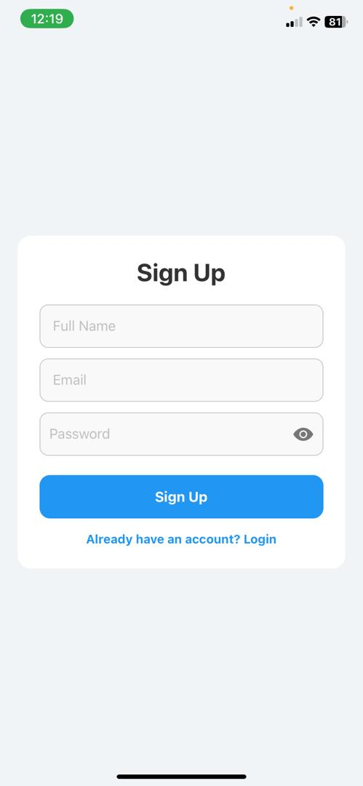
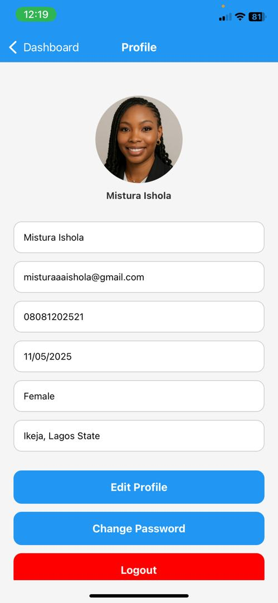
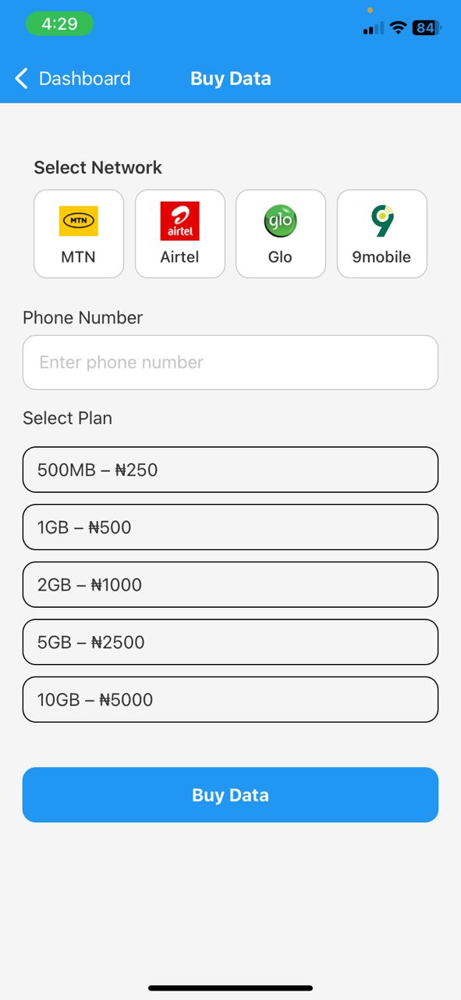
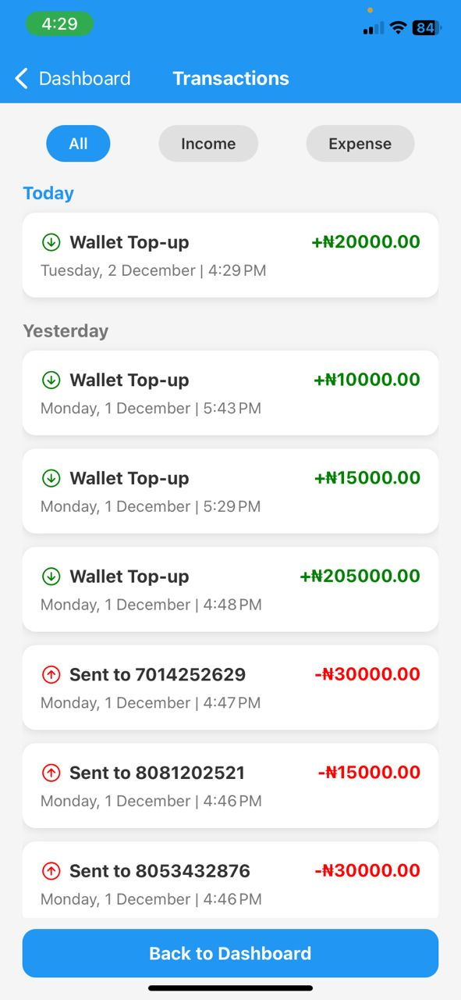

# TurahPay Wallet App

A cross-platform mobile wallet app built with **React Native** and **Expo** for managing finances and transactions, integrating **Firebase** for authentication and data management.

---

## Overview

**TurahPay Wallet App** allows users to securely manage their wallet, perform transactions and track recent activity. It includes login/signup with validation, a dynamic dashboard and profile management.

---

## Features

- **Login** & **Signup** with validation

- **Dashboard**: View wallet balance & recent transactions

- **Profile Management**: Edit user info and profile picture

- **Transaction Features**: Add Money, Send Money, Pay Bills, Buy Airtime & Data

- **Firebase Backend**: Authentication & Firestore for real-time data

- **Cross-platform**: Works on iOS and Android via Expo


---

## Tech Stack

- **Framework**: React Native

- **Expo**: Managed workflow for cross-platform development

- **Programming Language**: JavaScript

- **Backend & Database**: Firebase Authentication & Firestore

- **State Management**: React Context API

- **UI & Animation**: React Native components, LinearGradient, MaterialCommunityIcons, Animated API

- **HTTP Requests**: Axios

- **Storage**: Cloudinary & Firebase Storage for images

- **Version Control**: Git & GitHub

---

## Screenshots

| Login Screen | Signup Screen |
|--------------|---------------|
|  |  |

| Dashboard Screen | Profile Screen |
|-----------|----------------|
|  |  |

| Add Money | Send Money |
|-----------|-----------|
|  |  |

| Airtime Screen | Data Screen |
|-----------|-----------|
|  |  |

| Pay Bills Screen | Transaction History |
|-----------|-------------------|
|  |  |

 
---

## Installation

1. Clone the repository:
   ```bash
   git clone https://github.com/MisturaDev/wallet-app-react-native.git

2. Navigate into the project folder:
    ```bash
    cd wallet-app

3. Install dependencies.:
    ```bash
    npm install

4. Configure Firebase:
- Create a Firebase project
- Copy your config into firebase.js

5. Run the app (Expo):
   ```bash
   npx expo start 


 ---

## Usage

- Open the app via Expo

- Sign up or login with your credentials

- Access dashboard features: Add/Send Money, Pay Bills, Buy Airtime/Data

- Update profile info and upload profile picture

   
---

## Links
Expo Dashboard: [Expo](https://expo.dev/accounts/misturadev)

---

## Developer

**Mistura Ishola**

 [LinkedIn](https://www.linkedin.com/in/mistura-ishola/)


